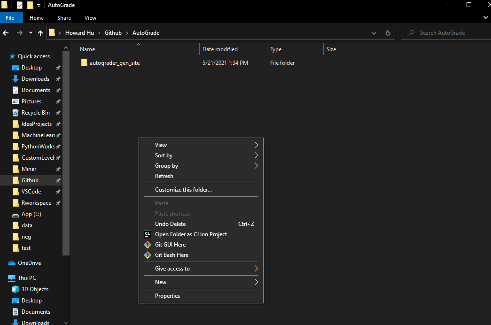
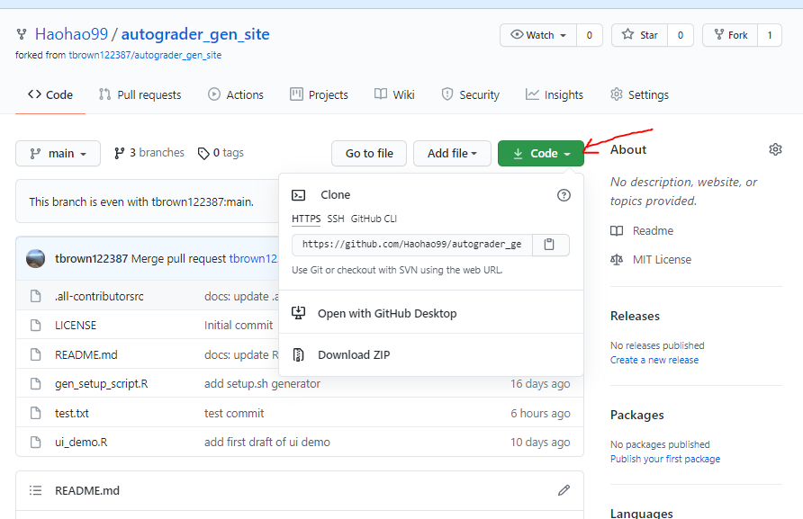
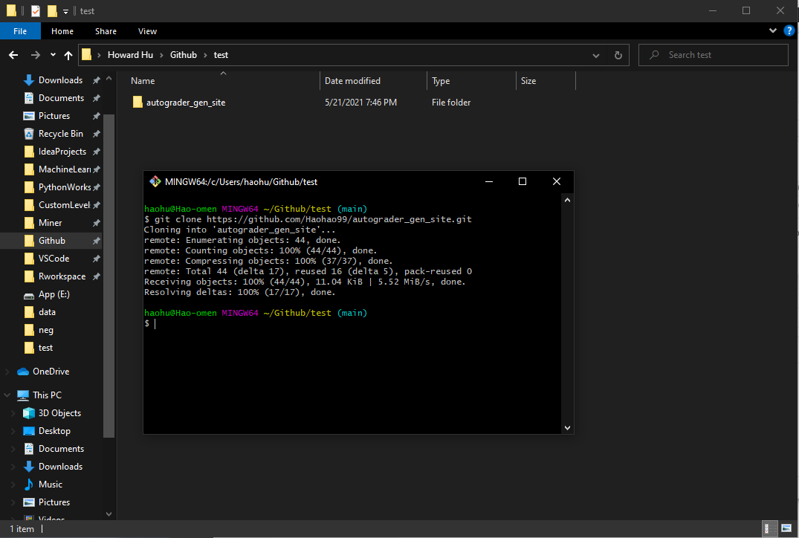
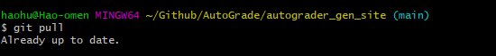
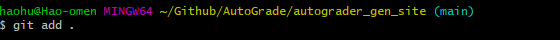
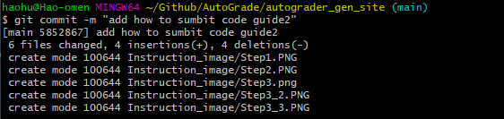
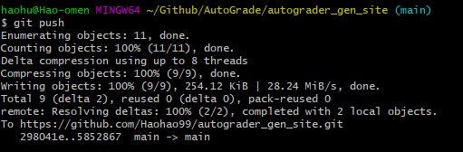
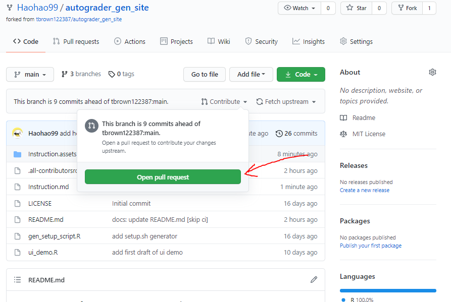
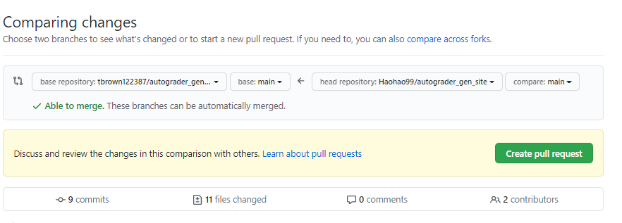
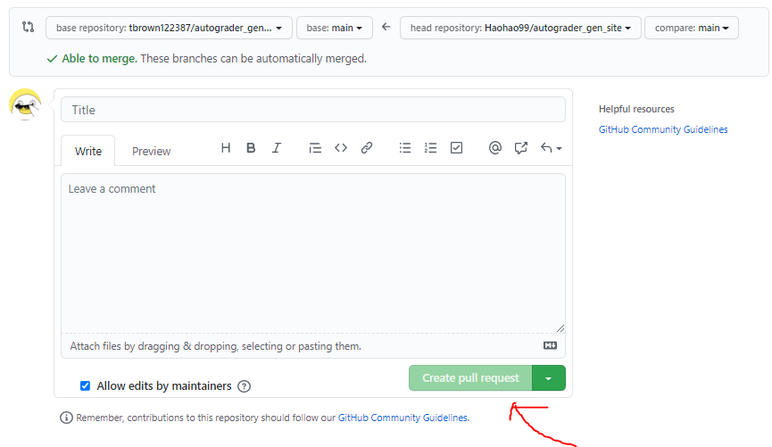

# How to submit codes to this repo

## Step 0

Please install Git into your operation system. You may use this following link: [https://git-scm.com/]( https://git-scm.com/)

## Step 1

If you have not Fork the repository, you need to click the Fork button on the top right to create your own repository. If you have already Fork the repo please go to step 2.

## Step 2

Please make sure your repo is up to date. When you are coding your repo, the main repo may have a new commit. To update your repo you can either use `git fetch origin` or you can click the following button under the Fetch upstream button.

## Step 3

You can create a local directory to save the codes from GitHub. You may name as "AutoGraderR" (the name totally depends on you). Then you can enter the directory and right-click Git Bash Here. It will give you a git terminal.

Then you can use `git clone https://github.com/[YOUR USER NAME]/autograder_gen_site.git` to clone a local repo. Please use your repo's URL otherwise you cannot push your code into the GitHub's repo. You can click Code button to check your URL.

If you successfully clone the main repo you will see a new folder has been add into the current directory. This will be your local repo.

## Step 4

Before you start coding, you **must** do `git pull`, otherwise, you will have a conflict issue. This command will pull every update to your local repo. After you finish your coding and test, you can use `git add .` to add every file into git. Then you can use    `git commit -m "YOUR COMMIT MSG"`    to add some commit message that describes your code. Then you need to use "git push" to submit code to your repo.

## Step 5

When you successfully push your code to your repo, you can click the Open pull request button to submit your code to the main repo.

Then you can add your description of your code here. Please explain your code as well as possible so that it can save a lot of time for reviewing those codes. Then you need to click the create pull request button.

## Step 6

Yeyyy! You have successfully submitted your code to the main repo and it will be waiting for the review to show in the repo.
